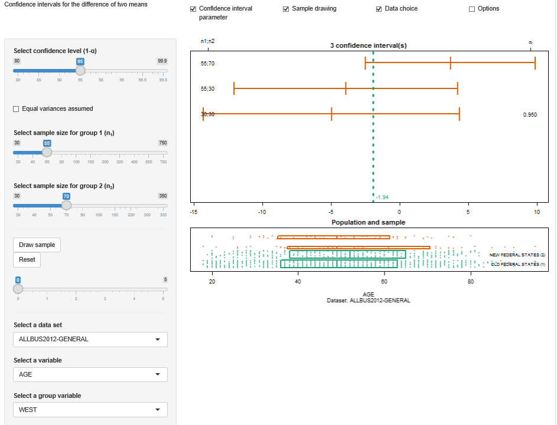

##  **MMSTATconfi_two_means**

##  [Shiny App](https://quantomas.shinyapps.io/MMSTATconfi_two_means)


```yaml

Name of QuantLet : MMSTATconfi_two_means

Published in : MMSTAT

Description : 'Estimates and plots the confidence interval for the difference of two means 
from two groups. The user can interactivaly choose the confidence level,
the respective sample sizes, and whether to assume equal or unequal variance.
In the lower panel, the population is shown and the interquartile range of
the sample is indicated by boxes.
Also, the user can choose between three data sets and set the variable and
group variable used to compute draw the samples.'

Keywords : 'plot, sampling, confidence interval, mean, population,
visualization, data visualization, parameter, interactive, 
t-distribution, distribution, estimation'

See also : 'KI, BCS_Boxplot, BCS_Boxplot2, MVAdrafthousing 
MMSTATtime_series_1, MMSTATlinreg, MMSTATconfmean, 
MMSTATconfi_sigma, MMSTATassociation, MMSTAThelper_function,
MMSTATconfi_pi, MMSTATcorrelation' 

Author : Yafei Xu

Submitted : 

Input: MMSTAThelper_function

Output : Interactive shiny application
 
Datafile : 
- ALLBUS2002-GENERAL.rds, 
- ALLBUS2004-GENERAL.rds,
- ALLBUS2012-GENERAL.rds

Example : 
- 'Shows the confidence interval for the settings: confidence level = 0.95,
sample size of group one = 55, sample size of group 2 = 70.
The considered data set is ALLBUS2012-GENERAL.rds and the variable is AGE.'

```





```R

# please use "Esc" key to jump out of the Shiny app
rm(list = ls(all = TRUE))
graphics.off()

# please set working directory setwd('C:/...') 
# setwd('~/...')    # linux/mac os
# setwd('/Users/...') # windows

source("MMSTAThelper_function.r")

############################### SUBROUTINES ##################################
################################# server #####################################

mmstat.ui.elem("conflevel", "confidenceLevel")
mmstat.ui.elem("varequal", "checkboxInput", 
               label = gettext("Equal variances assumed"), 
               value = FALSE)
mmstat.ui.elem("size1", "sampleSize",  
               label = HTML(gettext("Select sample size for group 1 \n\t\t\t                        
                                    (n<sub>1</sub>)")))
mmstat.ui.elem("size2", "sampleSize", 
               label = HTML(gettext("Select sample size for group 2 \n\t\t\t                        
                                    (n<sub>2</sub>)")))
mmstat.ui.elem("go", "drawSample")
mmstat.ui.elem("reset", "actionButton", label = gettext("Reset"), value = 0)
mmstat.ui.elem("speed", "speedSlider")
mmstat.ui.elem("dataset", "dataSet", 
               choices = mmstat.getDataNames("ALLBUS2012-GENERAL", 
                                             "ALLBUS2004-GENERAL", 
                                             "ALLBUS2002-GENERAL"))
mmstat.ui.elem("variable", "variable1", vartype = "numeric")
mmstat.ui.elem("group", "variable1", vartype = "binary", 
               label = gettext("Select a group variable"))
mmstat.ui.elem("cex", "fontSize")
confint = vector("list", 0)

CItwomeans = function(x1, x2, oma, var.equal = F, xlim = NULL) {
  n1  = length(x1)
  s12 = var(x1)
  n2  = length(x2)
  s22 = var(x2)
  if (var.equal) {
    dist = qt(1 - (1 - oma)/2, n1 + n2 - 2) * sqrt(((n1 - 1) * 
           s12 + (n2 - 1) * s22)/(n1 + n2 - 2) * (1/n1 + 1/n2))
  } else {
    df   = floor((s12/n1 + s22/n2)^2/(s12^2/n1^2/(n1 - 1) + 
                 s22^2/n2^2/(n2 - 1)))
    dist = qt(1 - (1 - oma)/2, df) * sqrt(s12/n1 + s22/n2)
  }
  upper = mean(x1) - mean(x2) + dist
  lower = mean(x1) - mean(x2) - dist
  if (is.null(xlim)) {
    lim = c(lower, upper)
  } else {
    lim = mmstat.merge(xlim, c(lower, upper))
  }
  list(upper = upper, lower = lower, mean = mean(x1) - mean(x2), 
       oma = oma, n1 = n1, n2 = n2, xlim = lim)
}

drawIqrBoxWithPoints = function(x, jitter, ylim, box.param = NULL, 
                                points.param = NULL) {
  if (is.list(points.param) || is.null(points.param) || points.param) {
    points.param$x = x
    points.param$y = ylim[1] + diff(ylim) * jitter
    suppressWarnings(do.call("points", points.param))
  }
  if (is.list(box.param) || is.null(box.param) || box.param) {
    q                 = quantile(x, c(0.25, 0.5, 0.75), na.rm = T)
    box.param$xleft   = q[1]
    box.param$xright  = q[3]
    box.param$ybottom = ylim[1]
    box.param$ytop    = ylim[2]
    suppressWarnings(do.call("rect", box.param))
    box.param$x       = c(q[2], q[2])
    box.param$y       = ylim
    if (!is.null(box.param$border)) 
      box.param$col = box.param$border
      suppressWarnings(do.call("lines", box.param))
  }
}

server = shinyServer(function(input, output, session) {
  output$conflevelUI = renderUI({
    mmstat.ui.call("conflevel")
  })
  output$varequalUI = renderUI({
    mmstat.ui.call("varequal")
  })
  output$goUI = renderUI({
    mmstat.ui.call("go")
  })
  output$resetUI = renderUI({
    mmstat.ui.call("reset")
  })
  output$speedUI = renderUI({
    mmstat.ui.call("speed")
  })
  output$datasetUI = renderUI({
    mmstat.ui.call("dataset")
  })
  output$cexUI = renderUI({
    mmstat.ui.call("cex")
  })
  output$size1UI = renderUI({
    var   = getVar()
    grp   = getGroup()
    ticks = mmstat.ticks(grp$tab[1], nmin = 30)
    mmstat.ui.call("size1", ticks = ticks, max = length(ticks))
  })
  
  output$size2UI = renderUI({
    var   = getVar()
    grp   = getGroup()
    ticks = mmstat.ticks(grp$tab[2], nmin = 30)
    mmstat.ui.call("size2", ticks = ticks, max = length(ticks))
  })
  
  output$variableUI = renderUI({
    inp = mmstat.getValues(NULL, dataset = input$dataset)
    mmstat.ui.call("variable", 
                   choices = mmstat.getVarNames(inp$dataset, "numeric"))
  })
  
  output$groupUI = renderUI({
    inp = mmstat.getValues(NULL, dataset = input$dataset)
    mmstat.ui.call("group", 
                   choices = mmstat.getVarNames(inp$dataset, "binary"))
  })
  
  getVar = reactive({
    inp         = mmstat.getValues(NULL, dataset = isolate(input$dataset), 
                                   variable = input$variable)
    var         = mmstat.getVar(inp$dataset, inp$variable, "numeric")
    var$ticks   = mmstat.ticks(var$n, nmin = 30)
    dec         = mmstat.dec(0.1 * c(0, var$sd/sqrt(max(var$ticks))))
    var$decimal = dec$decimal
    var
  })
  
  getGroup = reactive({
    inp = mmstat.getValues(NULL, 
                           group   = input$group, 
                           dataset = isolate(input$dataset))
    var = mmstat.getVar(inp$dataset, inp$group, "binary")
    var
  })
  
  resetCI = reactive({
    input$reset
    confint <<- vector("list", 0)
  })
  
  drawSample = reactive({
    inp = mmstat.getValues(NULL, 
                           go        = input$go, 
                           size1     = input$size1, 
                           size2     = input$size2, 
                           conflevel = input$conflevel, 
                           varequal  = input$varequal, 
                           speed     = input$speed)
    if (inp$speed > 0) 
      invalidateLater(500/inp$speed, session)
      var          = getVar()
      grp          = getGroup()
      ticks        = mmstat.ticks(grp$tab[1], nmin = 30)
      index        = (1:var$n)[grp$values == levels(grp$values)[1]]
      index1       = sample(grp$tab[1], ticks[inp$size1], replace = T)
      sampl1       = mmstat.attrVar(var, "numvars", index[index1])
      sampl1$group = levels(grp$values)[1]
      ticks        = mmstat.ticks(grp$tab[2], nmin = 30)
      index        = (1:var$n)[grp$values == levels(grp$values)[2]]
      index2       = sample(grp$tab[2], ticks[inp$size2], replace = T)
      sampl2       = mmstat.attrVar(var, "numvars", index[index2])
      sampl2$group = levels(grp$values)[2]
      nci          = length(confint)
    if (nci > 0) 
      xlim = confint[[nci]]$xlim else xlim = NULL
      clal = mmstat$UI$conflevel$ticks[inp$conflevel]/100
      confint[[nci + 1]] <<- CItwomeans(sampl1$values, sampl2$values, 
                                        clal, inp$varequal, xlim)
      list(sampl1, sampl2)
  })
  
  output$outputConfPlot = renderPlot({
    resetCI()
    var      = getVar()
    grp      = getGroup()
    samples  = drawSample()
    inp      = mmstat.getValues(NULL, cex = input$cex)
    nci      = length(confint)
    meandiff = mean(var$values[grp$values == samples[[1]]$group]) - 
               mean(var$values[grp$values == samples[[2]]$group])
    if (nci) {
      par(mar = c(2, 0, 2, 0))
      plot(0, 0, 
           type     = "n", 
           xlim     = confint[[nci]]$xlim, 
           ylim     = c(1.5, 2 + 0.2 * nci), 
           axes     = F, cex = 0.5, 
           col      = mmstat$col[[1]], 
           main     = sprintf(gettext("%i confidence interval(s)"), nci), 
           cex.axis = inp$cex, 
           cex.lab  = inp$cex, 
           cex.main = 1.2 * inp$cex, 
           cex.sub  = inp$cex)
      text(meandiff, 1.5, sprintf("%.*f", var$decimal, meandiff),
           col = mmstat$col[[1]], pos = 4, cex = inp$cex)
      usr  = par("usr")
      mmstat.axis(1, usr[1:2], cex.axis = inp$cex)
      seqi = 1:nci
      lwd  = 2 - (nci > 10)
      for (i in seqi) {
        yi  = 1.95 + 0.2 * i
        rng = c(confint[[i]]$lower, confint[[i]]$upper)
        col = ifelse((rng[1] > meandiff) || (rng[2] < meandiff), "black", 
                     mmstat$col[[2]])
        lines(rng, c(yi, yi), lwd = lwd, lty = "solid", col = col)
        lines(c(rng[1], rng[1]), c(yi - 0.05, yi + 0.05), lwd = lwd, 
              lty = "solid", col = col)
        lines(c(rng[2], rng[2]), c(yi - 0.05, yi + 0.05), lwd = lwd, 
              lty = "solid", col = col)
        lines(c(confint[[i]]$mean, confint[[i]]$mean), 
              c(yi - 0.05, yi + 0.05), lwd = lwd, lty = "solid", col = col)
      }
      n1    = sapply(confint, "[[", "n1")
      n2    = sapply(confint, "[[", "n2")
      index = 1 + c(0, which((diff(n1) != 0) | (diff(n2) != 0)))
      posx  = mmstat.pos(usr[1:2], c(0.05, 0.95))
      text(posx[1], 1.95 + 0.2 * index, 
           labels = sprintf("%.0f;%.0f", n1[index], n2[index]), 
           cex    = inp$cex)
      oma   = sapply(confint, "[[", "oma")
      index = 1 + c(0, which(diff(oma) != 0))
      text(posx[2], 1.95 + 0.2 * index, labels = sprintf("%.3f", oma[index]), 
           cex = inp$cex)
      axis(3, at = posx, labels = c(expression("n1;n2"), expression(alpha)), 
           cex.axis = inp$cex)
      abline(v = meandiff, col = mmstat$col[[1]], lwd = 3, lty = "dotted")
      box()
    }
  })
  
  output$outputSamplePlot = renderPlot({
    var     = getVar()
    grp     = getGroup()
    samples = drawSample()
    inp     = mmstat.getValues(NULL, cex = input$cex)
    par(mar = c(5, 0, 2, 0))
    plot(range(var$values), c(-0.05, 1), 
         type     = "n", 
         axes     = F, 
         main     = gettext("Population and sample"), 
         xlab     = var$xlab, 
         sub      = var$sub, 
         cex.axis = inp$cex, 
         cex.lab  = inp$cex, 
         cex.main = 1.2 * inp$cex, cex.sub = inp$cex)
    usr     = par("usr")
    mmstat.axis(1, usr[1:2], cex.axis = inp$cex)
    lgrp    = levels(grp$values)
    grp1    = grp$values == lgrp[1]
    drawIqrBoxWithPoints(var$values[grp1], var$jitter[grp1], 
                         ylim          = c(0, 0.2), 
                         box.param     = list(border = mmstat$col[[1]], lwd = 2), 
                         points.param  = list(col = mmstat$col[[9]], 
                         pch           = 19, 
                         cex           = 0.5 * inp$cex))
    text(usr[2], 0.1, paste(gettext(samples[[1]]$group), "(1)"), 
         pos = 2, cex = 0.75 * inp$cex)
    grp2 = grp$values == lgrp[2]
    drawIqrBoxWithPoints(var$values[grp2], var$jitter[grp2], 
                         ylim         = 0.25 + c(0, 0.2), 
                         box.param    = list(border = mmstat$col[[1]],  lwd = 2), 
                         points.param = list(col = mmstat$col[[9]], 
                         pch          = 19, 
                         cex          = 0.5 * inp$cex))
    text(usr[2], 0.35, paste(gettext(samples[[2]]$group), "(2)"), pos = 2, 
       cex = 0.75 * inp$cex)
    drawIqrBoxWithPoints(samples[[1]]$values, samples[[1]]$jitter, 
                         ylim         = 0.5 +  c(0, 0.2 * sqrt(length(samples[[1]]$values)/grp$tab[1])), 
                         box.param    = list(border = mmstat$col[[2]], lwd = 2), 
                         points.param = list(col = mmstat$col[[10]], 
                         pch          = 19, 
                         cex          = 0.5 * inp$cex))
    drawIqrBoxWithPoints(samples[[2]]$values, samples[[2]]$jitter, 
                         ylim         = 0.75 + c(0, 0.2 * sqrt(length(samples[[2]]$values)/grp$tab[2])), 
                         box.param    = list(border = mmstat$col[[2]], lwd = 2), 
                         points.param = list(col = mmstat$col[[10]], 
                         pch          = 19, 
                         cex          = 0.5 * inp$cex))
    box()
  })
  
  output$logText = renderText({
    mmstat.getLog(session)
  })
})

############################### SUBROUTINES ##################################
#################################### ui ######################################

ui = shinyUI(fluidPage( 
  div(class ="navbar navbar-static-top",
      div(class = "navbar-inner", 
          fluidRow(column(4, div(class = "brand pull-left", 
                   gettext("Confidence intervals for the 
                           difference of two means"))),
                   column(2, checkboxInput("showtest",
                                           gettext("Confidence interval parameter"), 
                                           TRUE)),
                   column(2, checkboxInput("showsample", 
                                           gettext("Sample drawing"), 
                                           TRUE)),
                   column(2, checkboxInput("showdata", 
                                           gettext("Data choice"), 
                                           FALSE)),
                   column(2, checkboxInput("showoptions", 
                                           gettext("Options"), 
                                           FALSE))))),     
    
  sidebarLayout(
    sidebarPanel(
      conditionalPanel(
        condition = 'input.showtest',
        uiOutput("conflevelUI"),
        br(),
        uiOutput("varequalUI"),
        br(),
        uiOutput("size1UI"),
        br(),
        uiOutput("size2UI")
      ),
      conditionalPanel(
        condition = 'input.showsample',
        hr(),
        uiOutput("goUI"),
        uiOutput("resetUI"),
        uiOutput("speedUI")
      ),
      conditionalPanel(
        condition = 'input.showdata',
        hr(),
        uiOutput("datasetUI"),
        uiOutput("variableUI"),
        uiOutput("groupUI")
      ),
      conditionalPanel(
        condition = 'input.showoptions',
        hr(),
        uiOutput("cexUI")
      )
    ),    
  mainPanel(plotOutput("outputConfPlot"),
            plotOutput("outputSamplePlot", height = "200px"))),
  htmlOutput("logText")
  )
)
 
############################### SUBROUTINES ##################################
################################ shinyApp ####################################

shinyApp(ui = ui, server = server)

```
