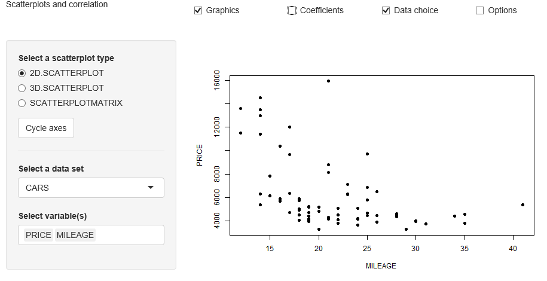

##  **MMSTATscatterplot**

```yaml

Name of QuantLet : MMSTATscatterplot

Published in : MMSTAT

Description : 'Shows either a 2D or 3D scatterplot. One has also the option to compute Pearson''s correlation and
Spearman''s rank correlation for variables of the data sets CARS, DECATHLON and USCRIME.'

Keywords : 'plot, scatterplot, correlation, data visualization, visualization, estimation, parameter, interactive,
uscrime, 3D, US crime data set'

See also : 'COPcorrelation1, COPcorrelation2, COPhac4firmsscatter, SFE5dim, MMSTATtime_series_1, MMSTATlinreg,
MMSTATconfmean, MMSTATconfi_sigma, MMSTATassociation, MMSTAThelper_function'

Author : Sigbert Klinke

Code Editor: Yafei Xu

Submitted : 21/08/2015

Input : MMSTAThelper_function

Output : Interactive shiny application
 
Datafiles : CARS.rds, DECATHLON.rds, USCRIME.rds

Example : Shows the 2-dimensional scatterplot for the variables PRICE and MILEAGE in the data set CARS.

```




```r
# ------------------------------------------------------------------------------
# Name of Quantlet: MMSTATscatterplot
# ------------------------------------------------------------------------------
# Published in:     MMSTAT
# ------------------------------------------------------------------------------
# Description:      Shows either a 2D or 3D scatterplot. One has also the option to compute Pearson's correlation and
#                   Spearman's rank correlation for variables of the data sets CARS, DECATHLON and USCRIME.
# ------------------------------------------------------------------------------
# Keywords:         plot, scatterplot, correlation, data visualization, visualization, estimation, parameter, interactive,
#                   uscrime, 3D, US crime data set
# ------------------------------------------------------------------------------
# Usage:            MMSTAThelper_function
# ------------------------------------------------------------------------------
# Output:           Interactive shiny application
# ------------------------------------------------------------------------------
# Example:          Shows the 2-dimensional scatterplot for the variables PRICE and MILEAGE in the data set CARS.     
# ------------------------------------------------------------------------------
# See also:         COPcorrelation1, COPcorrelation2, COPhac4firmsscatter, SFE5dim, MMSTATtime_series_1, MMSTATlinreg,
#                   MMSTATconfmean, MMSTATconfi_sigma, MMSTATassociation, MMSTAThelper_function
# ------------------------------------------------------------------------------
# Author :          Sigbert Klinke
# ------------------------------------------------------------------------------
# Code Editor:      Yafei Xu
# ------------------------------------------------------------------------------
# Datafiles:        CARS.rds, DECATHLON.rds, USCRIME.rds
# ------------------------------------------------------------------------------

# please use "Esc" key to jump out of the Shiny app
rm(list = ls(all = TRUE))
graphics.off()

# please set working directory setwd('C:/...') 
# setwd('~/...')    # linux/mac os
# setwd('/Users/...') # windows

libraries = c("scatterplot3d", "lattice")
lapply(libraries, function(x) if (!(x %in% installed.packages())) {
    install.packages(x)
})
lapply(libraries, library, quietly = TRUE, character.only = TRUE)

source("MMSTAThelper_function.r")

############################### SUBROUTINES ##################################
### server ###################################################################

mmstat$vartype = "numvars"
mmstat.ui.elem("graph", "radioButtons", 
               label    = gettext("Select a scatterplot type"), 
               choices  = gettext(c("2D.SCATTERPLOT", "3D.SCATTERPLOT", 
                                    "SCATTERPLOTMATRIX"), 
                                  "name"), 
               selected = "2D.SCATTERPLOT")
mmstat.ui.elem("permute", "actionButton", label = gettext("Cycle axes"))
mmstat.ui.elem("coeff", "checkboxGroupInput", 
               label   = gettext("Show coefficient(s)"), 
               choices = gettext(c("SHOW.BRAVAIS.PEARSON", "SHOW.SPEARMAN"), 
                                 "name"), 
               value   = character())
mmstat.ui.elem("dataset", "dataSet", 
               choices = mmstat.getDataNames("USCRIME", "CARS", "DECATHLON"))
mmstat.ui.elem("variableSelect", "variableN", 
               vartype  = "numeric", 
               selected = mmstat$dataset[[1]]$numvars[1:2])
mmstat.ui.elem("cex", "fontSize")

buildList = function(depth, v) {
  if (depth) {
    ret = buildList(depth - 1, v)
    mat = matrix(NA, nrow = length(v) * nrow(ret), ncol = ncol(ret) + 1)
    for (i in seq(v)) {
      ind1            = (1 + (i - 1) * nrow(ret)):(i * nrow(ret))
      ind2            = 1 + (1:ncol(ret))
      mat[ind1, ind2] = ret
      mat[(1 + (i - 1) * nrow(ret)):(i * nrow(ret)), 1] = v[i]
    }
    ind = apply(mat, 1, function(x, m) {
      length(unique(x)) == m
    }, m = depth + 1)
    return(mat[ind, ])
  }
  return(as.matrix(v, ncol = 1))
}

upper.panel = function(x, y, cex, coeff) {
  if (length(coeff)) {
    usr = par("usr")
    on.exit(par(usr))
    par(usr = c(0, 1, 0, 1))
    r   = abs(cor(x, y))
    txt = format(c(r, 0.123456789), digits = digits)[1]
    txt = paste0(prefix, txt)
    if (missing(cex.cor)) 
      cex.cor = 0.8/strwidth(txt)
    text(0.5, 0.5, txt, cex = cex.cor * r)
  } else {
    points(x, y, cex = 0.75, pch = 19)
  }
}

ct           = 0
last.permute = 0

server = shinyServer(function(input, output, session) {
  
  output$graphUI = renderUI({
    mmstat.ui.call("graph")
  })
  output$coeffUI = renderUI({
    mmstat.ui.call("coeff")
  })
  output$permuteUI = renderUI({
    mmstat.ui.call("permute")
  })
  output$datasetUI = renderUI({
    mmstat.ui.call("dataset")
  })
  output$cexUI = renderUI({
    mmstat.ui.call("cex")
  })
  
  output$variableSelectUI = renderUI({
    inp = mmstat.getValues(NULL, dataset = input$dataset)
    ret = mmstat.ui.call("variableSelect", 
                         choices = mmstat.getVarNames(inp$dataset, "numeric"))
    ret
  })
  
  observe({
    inp = mmstat.getValues(NULL, dataset = input$dataset)
    updateSelectInput(session, "variableSelect", 
                      choices  = mmstat.getVarNames(inp$dataset, "numeric"), 
                      selected = mmstat$dataset[[inp$dataset]]$numvars[1:2])
  })
  
  cycleList = reactive({
    inp = mmstat.getValues(NULL, graph = input$graph, 
                           variableSelect = input$variableSelect)
    maxdepth = length(inp$variableSelect)
    if (inp$graph == "2D.SCATTERPLOT") 
      maxdepth = 2
    if (inp$graph == "3D.SCATTERPLOT") 
      maxdepth = 3
    if (inp$graph == "SCATTERPLOTMATRIX") 
      maxdepth = min(maxdepth, 6)
    return(buildList(maxdepth - 1, inp$variableSelect))
  })
  
  output$scatterPlot = renderPlot({
    inp   = mmstat.getValues(NULL, 
                             dataset        = input$dataset, 
                             graph          = input$graph, 
                             permute        = input$permute, 
                             coeff          = input$coeff, 
                             variableSelect = input$variableSelect, 
                             cex            = input$cex)
    clist = cycleList()
    if (nrow(clist) == 0) {
      plot(0, 0, 
           xlim = c(-0.1, 0.1), 
           ylim = c(-0.1, 0.1), 
           type = "n", 
           axes = F, 
           xlab = "", 
           ylab = "", 
           pch  = 19, 
           cex  = 0.5)
      text(0, 0, gettext("Please select two, three or more variables!"), 
           cex = 1.5 * inp$cex)
    } else {
      if (inp$permute > last.permute) {
        # button was pressed
        last.permute <<- inp$permute
        ct <<- ct + 1
      }
      ct <<- ct%%nrow(clist)
      varx = mmstat.getVar(isolate(inp$dataset), varname = clist[ct + 1, 1], 
                           na.action = na.pass)
      if (varx$name == clist[ct + 1, 1]) {
        if (inp$graph == "2D.SCATTERPLOT") {
          vary = mmstat.getVar(inp$dataset, 
                               varname   = clist[ct + 1, 2], 
                               na.action = na.pass)
          plot(varx$values, vary$values, 
               xlab     = gettext(clist[ct + 1, 1]), 
               ylab     = gettext(clist[ct + 1, 2]), 
               cex.axis = inp$cex, 
               cex.lab  = inp$cex, 
               cex.main = inp$cex, 
               cex.sub  = inp$cex, 
               pch      = 19)
          if (length(inp$coeff)) {
          main = rep("", length(inp$coeff))
          for (i in seq(inp$coeff)) {
            if (inp$coeff[i] == "SHOW.BRAVAIS.PEARSON") {
            main[i] = sprintf(" &r[xy];=%+.2f", 
                              cor(varx$values, vary$values, use = "c"))
            }
            if (inp$coeff[i] == "SHOW.SPEARMAN") {
            main[i] = sprintf(" &r[s];=%+.2f", 
                              cor(varx$values, vary$values, 
                                  use = "c", method = "s"))
            }
          }
          title(main = mmstat.math(paste(main, collapse = ", ")))
          }
        }
        if (inp$graph == "3D.SCATTERPLOT") {
          vary = mmstat.getVar(isolate(inp$dataset), 
                               varname = clist[ct + 1, 2], na.action = na.pass)
          varz = mmstat.getVar(isolate(inp$dataset), 
                               varname = clist[ct + 1, 3], na.action = na.pass)
          scatterplot3d(varx$values, vary$values, varz$values, 
                        pch          = 19, 
                        cex          = 0.75, 
                        cex.axis     = 0.8 * inp$cex, 
                        cex.lab      = inp$cex, 
                        cex.main     = inp$cex, 
                        highlight.3d = T, 
                        xlab         = gettext(clist[ct + 1, 1]), 
                        ylab         = gettext(clist[ct + 1, 2]), 
                        zlab         = gettext(clist[ct + 1, 3]))
          if (length(inp$coeff)) 
        title(main = gettext("Coefficients are not available
                             for 3D Scatterplot"))
        }
        if (inp$graph == "SCATTERPLOTMATRIX") {
          dat = data.frame(varx$values)
          for (i in 2:length(clist[ct + 1, ])) {
            var      = mmstat.getVar(inp$dataset, 
                                     varname   = clist[ct + 1, i], 
                                     na.action = na.pass)
            dat[, i] = var$values
          }
          colnames(dat) = gettext(clist[ct + 1, ])
          splom(~dat, 
                pch           = 19, 
                col           = "black", 
                as.matrix     = T, 
                cex           = 1/sqrt(ncol(dat)), 
                varname.cex   = 1.5 * inp$cex/inp$cex/(ncol(dat)^(1/3)), 
                axis.text.cex = ifelse(ncol(dat) < 5, inp$cex/(ncol(dat)^(1/3)), 0), 
                coeff         = inp$coeff, 
                cex.coeff     = 1.5 * inp$cex/(ncol(dat)^(1/3)), 
                panel         = function(x, y, i, j, cex, coeff, cex.coeff, ...) {        
                  if (length(coeff)) {
                    if (i > j) {
                      panel.points(x, y, cex = cex, pch = 19, col = "black")
                    } else {
                      main = rep("", length(inp$coeff))
                      for (i in seq(inp$coeff)) {
                        if (inp$coeff[i] == "SHOW.BRAVAIS.PEARSON") {
                          main[i] = sprintf(" &r[xy];=%+.2f", cor(x, y, use = "c"))
                        }
                        if (inp$coeff[i] == "SHOW.SPEARMAN") {
                          main[i] = sprintf(" &r[s];=%+.2f", cor(x, y, use = "c", 
                                                                 method = "s"))
                        }
                      }
                      xpos = mean(range(x))
                      ypos = min(y) + diff(range(y)) * 
                   c(1, 3, 5)/(2 * length(coeff))
                      for (i in seq(main)) panel.text(xpos, 
                                                      ypos[i], 
                                                      mmstat.math(main[i]), 
                                                      cex = cex.coeff)
                    }
                  } else {
                    panel.points(x, y, cex = cex, pch = 19, col = "black")
                  }
                })
        }
      }
    }
  })
  
  output$logText = renderText({
    mmstat.getLog(session)
  })
})

############################### SUBROUTINES ##################################
### ui #######################################################################

ui = shinyUI(fluidPage(
  div(class="navbar navbar-static-top",
      div(class = "navbar-inner", 
          fluidRow(column(4, div(class = "brand pull-left", 
                                 gettext("Scatterplots and correlation"))),
                   column(2, checkboxInput("showgraph", 
                                           gettext("Graphics"), 
                                           TRUE)),
                   column(2, checkboxInput("showcoeff", 
                                           gettext("Coefficients"), 
                                           FALSE)),
                   column(2, checkboxInput("showdata", 
                                           gettext("Data choice"), 
                                           TRUE)),
                   column(2, checkboxInput("showoptions", 
                                           gettext("Options"), 
                                           FALSE))))),
    
  sidebarLayout(
    sidebarPanel(
      conditionalPanel(
        condition = 'input.showgraph',
        uiOutput("graphUI"),
        uiOutput("permuteUI")
      ),
      conditionalPanel(
        condition = 'input.showcoeff',
        hr(),
        uiOutput("coeffUI")
      ),
      conditionalPanel(
        condition = 'input.showdata',
        hr(),
        uiOutput("datasetUI"),
        uiOutput("variableSelectUI")
      ),
      conditionalPanel(
        condition = 'input.showoptions',
        hr(),
        uiOutput("cexUI")
      )
    ),
    mainPanel(plotOutput("scatterPlot"))),

  htmlOutput("logText")  
))

############################### SUBROUTINES ##################################
### shinyApp #################################################################

shinyApp(ui = ui, server = server)

```
